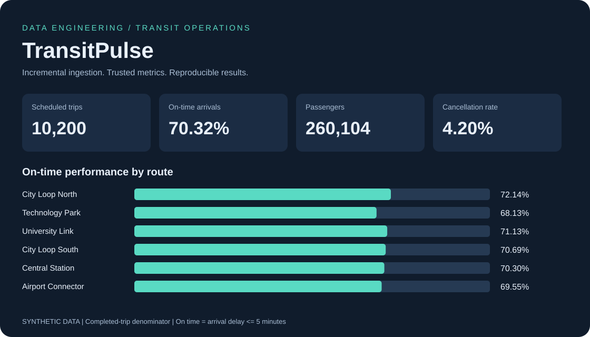

# MyProjects
The list of my personal projects , all with their codes and Data.

## Featured project

### [TransitPulse — Transit Operations Analytics](transitpulse/)

A runnable Python and SQL data pipeline with incremental ingestion, late-arriving corrections,
data-quality quarantine, an offline dashboard and Power BI modelling assets. Includes an
optional Azure Data Factory, ADLS Gen2 and Azure Functions deployment path.

[Explore the project](transitpulse/) · [Architecture](transitpulse/docs/architecture.md) · [Power BI guide](transitpulse/powerbi/README.md)

