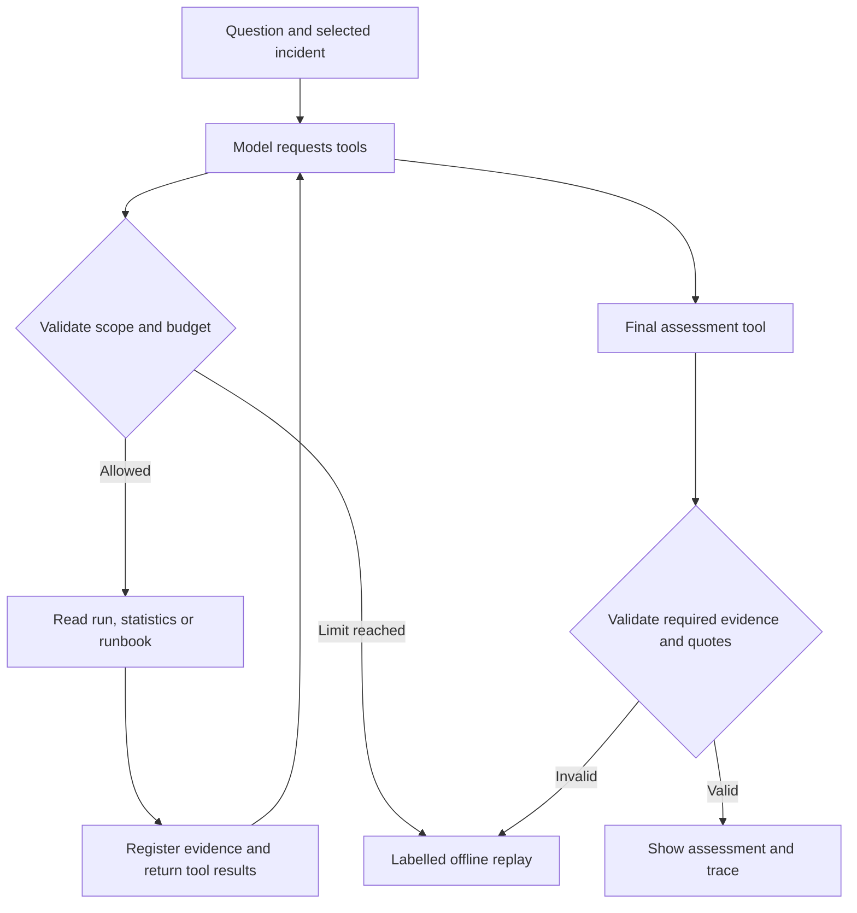

# OpsEvidence walkthrough

## 1. Explore the data

Run `python -m opsevidence list`, then `python -m opsevidence investigate run-0420`. `data/runs.json` contains 420 fictional pipeline runs over 28 days; `runbooks.json` contains authored summaries and links to official Azure documentation. No client data is used.

## 2. Follow an investigation

The incident ID selects a failed row. Python creates an in-memory SQLite database and enables query-only mode. `get_run` accepts only that incident ID. `pipeline_stats` accepts 1–28 days and uses fixed parameterised SQL for the selected pipeline; the UTC window ends at the incident timestamp. `search_runbooks` performs lexical BM25 retrieval with exact error-code matching.

`agent.py` executes at most four model turns and six data-tool calls. Unknown tools and out-of-scope IDs return errors. Final output must arrive alone and only after run, statistics and runbook evidence have been gathered. Every observation needs an existing evidence ID and exact quote; suggested checks must cite runbooks. No tool can change resources, run arbitrary SQL or access a model-supplied file path.

Offline mode replays get_run, seven-day statistics and error-code retrieval in a fixed order. Live mode lets the model choose valid tool arguments and compose the assessment. This distinction appears in every result.

## 3. Inspect the protocol

Read `providers.py` and the `test_live_two_provider_tool_loop` test. Azure appends assistant tool calls followed by one role=tool message per call ID. Claude appends assistant tool_use blocks followed immediately by a user message containing matching tool_result blocks. Multiple tool requests receive grouped results. Duplicate IDs, truncation and malformed responses are rejected.

## 4. Exercises

- Compare `run-0408` and `run-0420`: different error codes should retrieve different runbooks.
- Change a statistics window from seven days to one and verify counts from the fixture.
- Attempt an out-of-scope get_run call in a test and inspect its rejection.
- Alter a citation quote: validation should reject the answer.
- Configure each provider and record relevant answers, cost, latency and failure rates on a held-out test set. Existing mocked tests do not measure real model quality.
- Extend with Azure AI Search, managed identity or MCP only after understanding the current loop.

## 5. Explain design decisions

The model proposes calls; application code controls execution and scope. Retrieval provides supporting text but cannot prove a root cause. Exact quotes limit fabricated evidence but do not guarantee semantic correctness. Budgets bound this demo's requests, not an enterprise spending account. Production use would require identity controls, durable telemetry, evaluation and deployment work.
