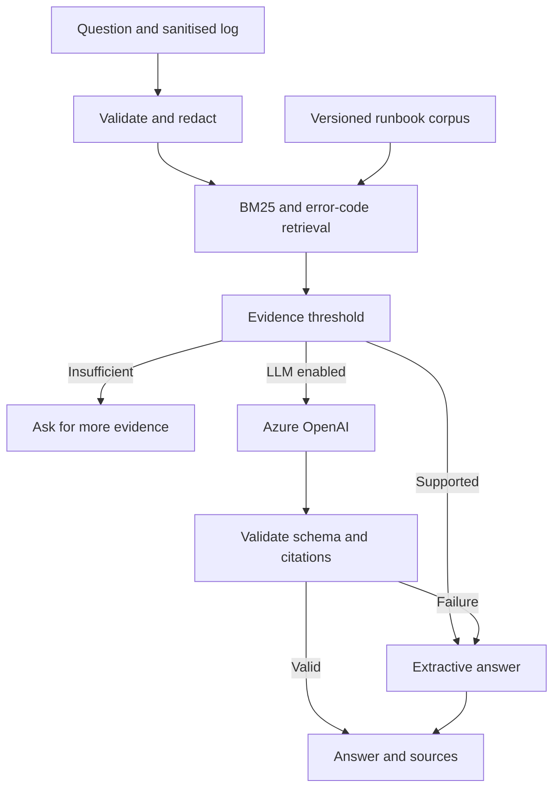

# PipelineCopilot

**A source-cited troubleshooting assistant for Azure data pipeline failures.**

[](https://github.com/Jaswanth-16/MyProjects/actions/workflows/pipelinecopilot-ci.yml)

Ask why a Copy activity failed, paste a sanitised log, and get investigation checks linked to
relevant runbooks and official Microsoft documentation. Designed around the ADF, SQL, Azure
Functions and access-control problems a data engineer encounters.

## Run locally

Python 3.11 or 3.12; **no third-party dependencies** for retrieval, tests or the UI.

```bash
git clone https://github.com/Jaswanth-16/MyProjects.git
cd MyProjects/pipelinecopilot
python -m pipelinecopilot serve
```

Open **http://127.0.0.1:8765**. Choose storage access, schema drift or throttling samples,
then click **Investigate**. Unknown topics return an insufficient-evidence response.
Use `python3` if that is your Python command. Stop with Ctrl+C.

Other entry points:

```bash
python -m pipelinecopilot ask "Why is my SQL copy failing with SqlTimeout?"
python -m pipelinecopilot demo
python -m pipelinecopilot evaluate
python -m unittest discover -s tests -v
```

`ask` accepts `--log path/to/sanitised-log.txt`. Log contents are text; no cloud resources are
queried or changed. Server input is not stored, and request logging is disabled.

## Two explicit modes

| Mode | Implementation | Credentials / network |
|---|---|---|
| Retrieval, default | BM25 lexical search, exact error-code boost, curated extractive checks | None; works offline |
| LLM, opt-in | Retrieved context + sanitised logs sent to Azure OpenAI v1 or opt-in Groq; structured answer with validated citation IDs | Your Azure deployment and API key; requests may incur charges |

The default mode **does not generate AI text**. The optional adapter makes this a RAG application;
retrieval is lexical, not embedding/vector search. Azure AI Search is a possible future replacement
for the small in-memory index, not a component claimed as already deployed.

## Optional Azure OpenAI setup

Set these variables in your shell; the program does not load `.env` automatically:

```text
PIPELINECOPILOT_AZURE_BASE_URL=https://YOUR-RESOURCE.openai.azure.com/openai/v1
PIPELINECOPILOT_AZURE_API_KEY=YOUR_KEY
PIPELINECOPILOT_AZURE_DEPLOYMENT=YOUR_CHAT_DEPLOYMENT_NAME
```

Then run `python -m pipelinecopilot serve --llm` or
`python -m pipelinecopilot ask "SqlTimeout during ingestion" --llm`.
The deployment must support Chat Completions JSON mode and `max_completion_tokens`.
The deployment name is the `model` field. No model or paid resource is provisioned automatically.
The adapter allows only Azure HTTPS endpoints, refuses redirects, times out after 25 seconds,
and validates response fields and cited IDs. Failed requests or invalid model output return the
extractive fallback with a visible warning. Keys stay on the server and are never put in the UI.

[Official v1 API guidance](https://learn.microsoft.com/en-us/azure/ai-foundry/openai/api-version-lifecycle)

## Architecture



Eight portfolio-authored runbooks cover storage authorization, SQL timeout, schema mismatch,
self-hosted runtime availability, throttling, duplicate replay, credential expiry and Function
invocation failures. Each includes investigative checks, example identifiers and official source
links. Some identifiers are illustrative grouping labels rather than universal Azure error codes.
The corpus is bundled and versioned; official pages are not crawled at runtime. Links support
verification, not a claim that every sentence is a quotation or proven diagnosis.

## Measured local results

- **41 automated tests passed**, including real loopback HTTP requests and mocked provider transport.
- **30 curated evaluation cases:** correct first runbook for 24/24 supported questions; abstention on 6/6 unrelated questions.
- Three reproducible sample scenarios, including log redaction and insufficient evidence.

See [evaluation results](docs/evaluation-results.json) and [demo output](docs/demo-results.json).
This is a small developer-authored benchmark, not an independent dataset or general accuracy claim.
Exact code cases and paraphrases are included. Live LLM answer quality, semantic grounding and
production root-cause accuracy are **not measured** by these retrieval results.

## Boundaries and next steps

Redaction is best effort; sanitise input yourself and never paste employer logs or secrets. LLM
mode sends the remaining text to your configured provider. Citation membership checks prevent
invented IDs but cannot prove that model prose is supported by the cited text. Prompt instructions
reduce risk; they do not establish complete prompt-injection protection.

The server binds to loopback, validates Host and Origin, applies request limits and a strict CSP,
and renders answers with `textContent`. It is a local demo, not an authenticated production API.
The assistant has no tools for running SQL, commands or resource changes.

Live Azure inference has not been executed during creation; no credentials were available and no
paid requests were made. For a production extension add identity authentication, access-filtered
retrieval, vector/hybrid search, reviewed runbooks, richer independent evaluation, operational
monitoring and a proper application server.

## Guides

- [Design decisions, code walkthrough and limits](docs/architecture.md)
- [Interview preparation and honest resume wording](docs/portfolio-guide.md)

## Free-plan live testing with Groq

Set `GROQ_API_KEY` and `GROQ_MODEL` in your terminal using your own [Groq Free-plan account](https://console.groq.com/keys). Choose a current model that supports JSON mode; stay within [model-specific free rate limits](https://console.groq.com/docs/rate-limits).

```bash
python -m pipelinecopilot serve --llm --provider groq
python -m pipelinecopilot ask "SqlTimeout during ingestion" --llm --provider groq
```

The Groq adapter uses the fixed OpenAI-compatible endpoint and bearer authentication, with the same output/citation validator and labelled fallback as Azure. Incomplete (`length`) responses are rejected. A Groq success does not demonstrate Azure deployment or Azure model behavior. See the repository [testing report](../TESTING.md) and strict live smoke command there. Keys are never bundled or printed.
