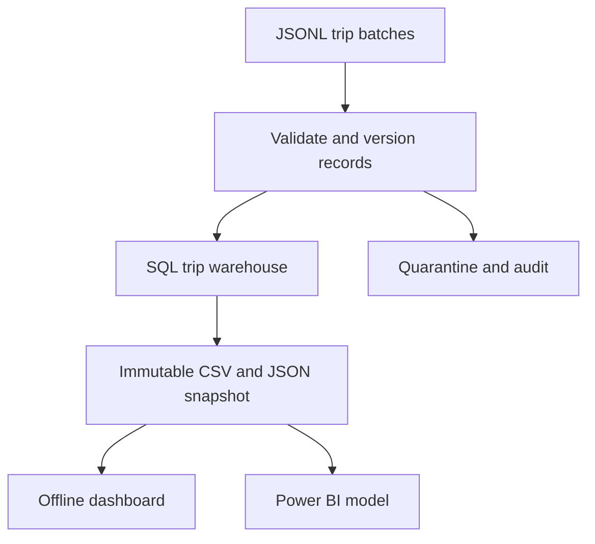

# TransitPulse

**Transit operations analytics with reliable incremental ingestion.**

[](https://github.com/Jaswanth-16/MyProjects/actions/workflows/transitpulse-ci.yml)

Transit operators need to measure reliability, passenger demand and revenue even when
source feeds contain duplicates, late corrections and invalid records. TransitPulse turns
a fictional post-trip feed into a current-state SQL warehouse and reproducible analytics.


## Run in one minute

Requires Python 3.11 or 3.12 and Git. The local pipeline has **no third-party dependencies**.

```bash
git clone https://github.com/Jaswanth-16/MyProjects.git
cd MyProjects/transitpulse
python -m transitpulse demo --workspace workspace --count 10000
python -m unittest discover -s tests -v
```

Use `python3` if that is your Python command. Open `dashboard.html` in the export directory
printed by the demo. `workspace/LATEST.json` records that directory. The dashboard works
offline and supports depot and date filters. A second demo needs a new workspace name;
the command refuses to overwrite your files.

## What is implemented

| Capability | Evidence |
|---|---|
| Incremental file ingestion | SHA-256 batch ledger skips content already committed |
| Corrected and late records | Per-trip update time selects the newest version; no global timestamp cutoff |
| Data quality | Strict schema, UTC normalization, route references, capacity and cancellation rules |
| Failure recovery | Fact changes and ingestion ledger commit in one SQLite transaction |
| Quarantine and observability | Rejection reasons, line numbers, batch metrics, failure audits and freshness watermarks |
| SQL analytics | Trip fact, route/date dimensions, daily route aggregates and KPI views |
| Offline dashboard | Generated HTML with depot/date filters and route scorecard |
| Power BI assets | Typed Power Query imports, DAX measures, depot RLS example and report guide |
| Optional Azure path | ADF pipeline, ADLS identity access, Function adapter and Bicep infrastructure |
| Safe cloud publication | Immutable snapshots plus an ETag compare-and-swap on `state/HEAD.json` |
| CI | Unit tests, full demo reconciliation, function discovery and Bicep compilation |

## Reproducible demonstration

Default seed: **42**. These are synthetic test results, not production business outcomes.

| Stage | Result |
|---|---:|
| Initial batch | 10,000 trips inserted |
| Incremental batch | 360 input records |
| New trips | 200 inserted |
| Corrections | 100 existing trips updated |
| Exact row duplicates | 30 unchanged |
| Older versions | 20 ignored |
| Invalid rows | 10 quarantined |
| Final unique trips | **10,200** |
| Exact batch replay | Skipped; no additional facts |

[Machine-readable results](docs/demo-results.json) contain the executed demo's metrics.
Run IDs and elapsed time vary; deterministic inputs and business KPIs remain reproducible.

## Architecture



The local implementation uses SQLite deliberately: anyone can run and inspect the
transactional logic without an account or service. The optional Azure path archives input
with ADF, runs the same processing code in an authenticated Function and stores versioned
outputs in ADLS Gen2. See [design decisions](docs/architecture.md).

## Guides

- [Data contract and KPI definitions](docs/data-contract.md)
- [Architecture, guarantees and trade-offs](docs/architecture.md)
- [Power BI setup and RLS](powerbi/README.md)
- [Azure deployment and cleanup](docs/azure-deployment.md)
- [Interview walkthrough and resume wording](docs/portfolio-guide.md)

## Individual commands

```bash
python -m transitpulse generate --output workspace-custom/input --count 10000
python -m transitpulse run --db workspace-custom/warehouse.sqlite --input workspace-custom/input/initial.jsonl
python -m transitpulse run --db workspace-custom/warehouse.sqlite --input workspace-custom/input/delta.jsonl
python -m transitpulse export --db workspace-custom/warehouse.sqlite --output workspace-custom/export-001
```

The default quality gate permits **at most 5%** rejected records. Higher rejection rates
fail the batch and roll back fact changes and the ledger. Row rejection evidence and a
failed-run audit remain available. File-level errors such as invalid UTF-8, empty input
or oversized input fail before the database transaction and appear on stderr.

## Validation scope

The local pipeline, cloud coordinator and Azure SDK boundary have automated tests.
Cloud concurrency tests use an in-memory object store; SDK tests mock remote transport.
The Azure resources have **not been deployed to a live subscription** as part of project creation.
Power BI import/model instructions and DAX are supplied; a finished `.pbix` report is not included.
The HTML dashboard is a separate working preview, not a Power BI screenshot.

For cloud SDK tests, install `requirements.txt` in a virtual environment first. Without
those optional packages, the five adapter tests are explicitly skipped.

## Scope and limits

This is a portfolio-sized batch pipeline: maximum input size 10 MiB and cloud warehouse
download size 50 MiB. It is not a streaming platform or a distributed warehouse. For larger
workloads, replace snapshot SQLite state with a transactional shared data store, add a
durable asynchronous execution model, and partition analytical storage. No employer code,
confidential information or real passenger data is included.
