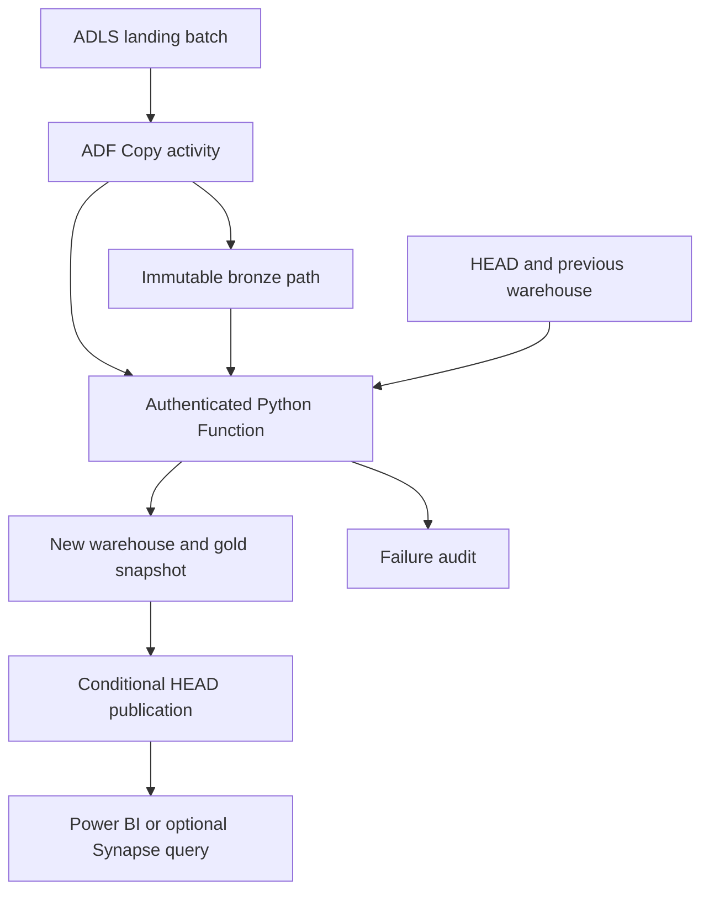

# Architecture and trade-offs

## Incremental ingestion

The feed is a sequence of immutable JSONL files. SHA-256 of the complete file is the
batch identity. Renaming an identical file does not reprocess it. Reformatting a file
changes its hash, so per-trip version checks provide a second idempotency layer.

`trip_id` is the business key. `updated_at_utc` is the source record version:

| Incoming version | Action |
|---|---|
| New trip key | Insert, even if its timestamp is older than other trips |
| Newer timestamp | Update the current fact |
| Same timestamp and canonical payload | Count unchanged |
| Same timestamp, different payload | Quarantine a version conflict |
| Older timestamp | Count stale; keep current fact |

The exported route watermarks describe freshness; they are **not extraction filters**.
This avoids dropping previously unseen late trips. A timestamp-only extraction strategy
would need a replay/lookback policy or source change tracking. The ledger assumes the
upstream producer publishes complete, immutable batches.

Facts represent current state (Type 1 updates). Historical versions are retained only
in source batches, not in a Type 2 dimension. Hard deletes are not supported. A cancellation
is an explicit versioned update with zero passengers/revenue and no actual arrival.

## Transaction boundary

SQLite `BEGIN IMMEDIATE` serializes local writers before checking the batch ledger.
Validation and upserts happen in the same transaction. At or below the rejection limit,
facts, the batch ledger, audit and quarantine commit together. Above the limit, facts and
ledger roll back; a separate transaction preserves the failed audit and quarantine.
Database faults likewise roll back the fact/ledger transaction. Failure metrics distinguish
attempted inserts/updates from the zero committed changes.

Exports run under one read transaction and create a new directory. They never overwrite
an existing export. If export fails, retry into another new directory; the warehouse
already contains committed facts and can safely regenerate the outputs.

## Optional Azure flow

The Function reads the current HEAD and its ETag, restores the committed SQLite snapshot,
applies the new batch, then uploads all outputs and the new database to unique paths.
Only after those uploads succeed does it conditionally replace HEAD using the previously
read ETag. A concurrent writer causes HTTP 409 and a retry against the newer snapshot.
Failures before publication leave the current HEAD unchanged. Orphaned unreferenced
snapshots are harmless to readers but consume storage; lifecycle/garbage collection is
an explicit future extension and is not automatically configured.

ADF serializes its pipeline runs and retries failures twice. The ETag guard also protects
against callers outside ADF. Consumers must read one HEAD and use its exact snapshot;
globbing all snapshots would double count full-state exports. Power BI cloud refresh and
automatic Synapse view advancement are not implemented.

## Security and operational scope

The Function uses a managed identity for lake access. ADF uses its managed identity for
the lake and Key Vault; its Function access key is stored in Key Vault. The Function HTTP
trigger requires a key. HTTPS is enabled and blob public access is disabled. The Function
runtime uses a separate host-storage connection setting; it is generated during deployment,
never emitted in project files. The demo uses public service endpoints with authenticated
access; private endpoints and a full production network design are out of scope.

Limits keep synchronous requests and full snapshot copies suitable for the demo. Azure
Function HTTP execution has a service timeout; large workloads should use queues or
Durable Functions rather than increasing batch size. Native cloud resource provisioning,
RBAC propagation and service integration still require a live deployment test.

## References

- [Microsoft: incremental load patterns](https://learn.microsoft.com/en-us/azure/data-factory/tutorial-incremental-copy-overview)
- [Microsoft: ADLS Gen2 connector](https://learn.microsoft.com/en-us/azure/data-factory/connector-azure-data-lake-storage)
- [Microsoft: blob optimistic concurrency](https://learn.microsoft.com/en-us/azure/storage/blobs/concurrency-manage)
- [Microsoft: Azure Function activity and timeout](https://learn.microsoft.com/en-us/azure/data-factory/control-flow-azure-function-activity)
